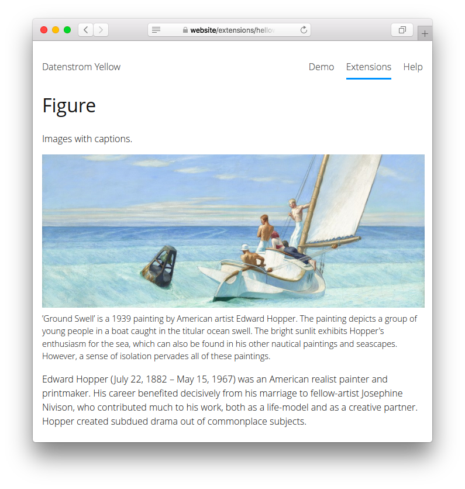

# Figure 0.9.1

Images with captions.

## How to install an extension

[Download ZIP file](https://github.com/GiovanniSalmeri/yellow-figure/archive/refs/heads/main.zip) and copy it into your `system/extensions` folder. [Learn more about extensions](https://github.com/annaesvensson/yellow-update).

## How to add an image with caption

Use the shortcut `figure`. Arguments, functionality and settings are the same as for [Image](https://github.com/annaesvensson/yellow-image), except that the `Alt` argument is mandatory and used for the caption.

## Examples

Adding images with captions, with differents styles and sizes:

    [figure photo.jpg "This is the caption of the image"]
    [figure photo.jpg "This is the caption of the image" left]
    [figure photo.jpg "This is the caption of the image" right 50%]
    [figure photo.jpg "This is the caption of the image" right 320 200]

## Acknowledgements

This extension requires and uses [Image](https://github.com/annaesvensson/yellow-image) by Anna Svensson. Thank you for the good work.

## Developer

Giovanni Salmeri. [Get help](https://datenstrom.se/yellow/help/).
